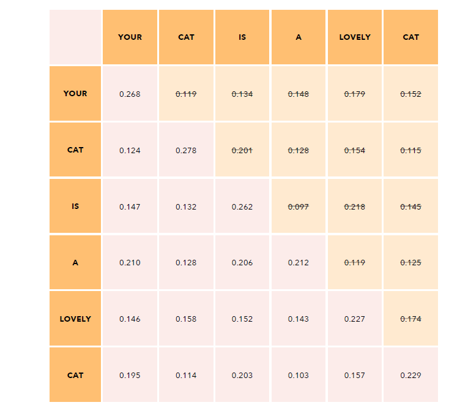

# Attention is All Your Need

## Recurrent Neural Networks (RNN)&#x20;

is sequential process, and need improvements.

* Slow computation for long sequences
*   Vanishing or exploding gradient

    d(`output`)/d(`input`) is a chain of  d(`next_state_function`)/d(`current_state_function`), so it may be too small if each gradient is < 1 or too large vice versa.&#x20;
* Difficulty in accessing information from long time ago, the last computation may not know much information after first computation, but as human we know they are more related.

## Transformer

Basically left is Encoder and right is Decoder.

<figure><figcaption>
Transformer Model
</figcaption></figure>

### &#x20;Input Embedding:&#x20;

1. Tokenize the input sentence (each token maybe more than single word)
2. Convert tokens into numbers that represent positions in a vocabulary training set
3. Embed a number to a vector of numbers that represnet meaning od the word (this is model-unique and may change along with the training process).  The _**size**_ of this is called the $$d_{model}$$.

<figure><figcaption>
Input Embedding
</figcaption></figure>

### Positional Encoding

We want each token to carry some information about its position in the setence, so model can understand position relation of token.

An fixed vector of numbers (size is $$d_{model}$$) that represents the token position will be added to the embedding vector. Sum to the **Encoder input**.

The value in the position vector is caclulated by PE functions. PE only takes in position and 2i/2i+1, so it's not related to the token and can be applied to different sentences in one model.

<figure><figcaption>
PE function
</figcaption></figure>

### Multi-Head Attention

#### Single Head Self Attention

Self attention allows the model to relate words to each other.

$$Attention(Q,K,V) = softmax(QK^T/\sqrt{d_{k}})V$$&#x20;

Q,K,V here are both a same matrix, the **Encoder Input**. $$d_k = d_{model}$$ here.

E.g. for 6 tokens and  $$d_{model}$$= 512, Q\*K will be a 6x6 matrix. And $$softmax()$$ is like normalize that ensure each row sums to 1.

<figure><figcaption>
Softmax function
</figcaption></figure>

Then we multiple it again with V, the initial (6, 512) encoder input, get another (6, 512) matrix that contains meaning in vocabulary/ position in sentence/ token interactions.

#### Multi-Head Self Attention

$$MultiHead(Q,K,V) = Conact(head_1 ... head_n) W^O$$

The encoder input (use 6,512 as example) got copied 4 times.

<figure><figcaption>
Encoder
</figcaption></figure>

Q, K, V stands for query, key and value.

$$W^Q, W^K, W^V$$ are parameter matrices in shape $$(d_{model}, d_{model})$$.&#x20;

After multiplication with parameters, we split the output into _h_ matrices, h stands for # of heads.

$$head_i=Attention({QW^Q}_i,{KW^K}_i,{VW^V}_i)$$ is then used to caculate attention of each piece.

Then a $$Conact()$$is called so we still got a (6, 512) shape matrix, named _H._

<figure><figcaption>
MultiHead Attention
</figcaption></figure>

The last step is to&#x20;
